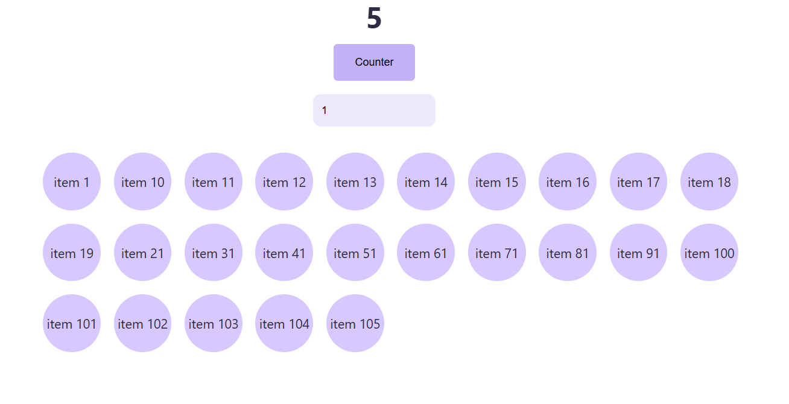
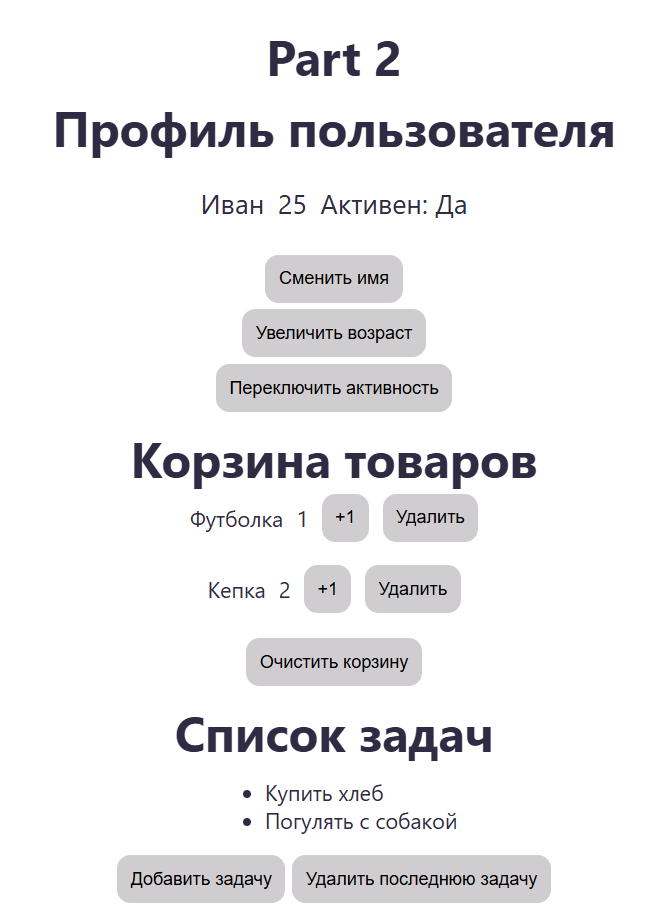

# useMemo and useCallback homework. Lesson 2.4 Part 1

# React.memo homework. Lesson 2.4 Part 2
* Без React.memo компонент UserInfo перерисовывается с каждым изменением стейта в родительском компоненте App:при любом вводе в инпут поиска и при клике на counter. С React.memo компонент перерисовывается только в случае изменений props user
* Если не обернуть функции из ItemCart в useCallback и не передать их как ссылки (именно ссылки, а не оборачивать их в стрелочную функцию-обертку с перебросом аргумента из дочернего элемента) в CartItem, компонент CartItem будет перерисовываться несмотря на memo-обертку HOC и useCallback-обертку для plusOneHandler и deleteItemHandler. Т.к. анонимная стрелочная функция создается заново.
* с TaskItem такая же история как и с другими компонентами. Без HOC memo-обертки TaskItem перерисовывается с каждым изменением стейта в App. Т.к. при перерисовке родительского компонента по умолчанию перерисовываются все его дочерние компоненты и следовательно и дочерние компоненты этих дочерних компонентов.
